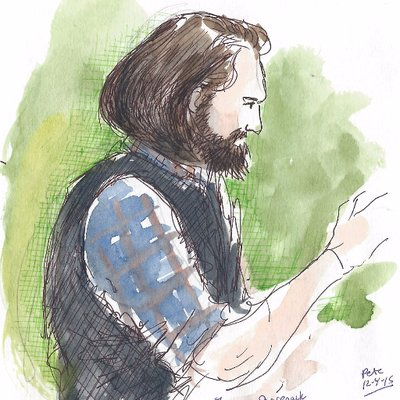

  

    
  

  

    <h1 style="margin: 0; font-size: 2.2rem; color: #2c3e50;">James Sharpnack</h1>
    

      

        <strong>Staff AI Research Scientist</strong> 
        <a href="https://www.duolingo.com/" style="color: #58cc02;">Duolingo</a>
      

      

        <strong>ex-Tenured Professor</strong> 
        <a href="https://statistics.ucdavis.edu/" style="color: #3498db;">UC Davis Statistics Department</a>
      

    

    

      <strong>Research Impact:</strong> 10 PhD Students Graduated • 43+ Publications • AI in Education Innovator • COVID-19 Public Health Response Leader
    

  

  <h2 style="color: #2c3e50; border-bottom: 2px solid #3498db; padding-bottom: 0.5rem;">Research Areas</h2>
  

    <a href="/publications/#education" style="text-decoration: none; color: inherit;">
      

        <h3 style="margin: 0 0 0.5rem 0; color: #e74c3c;">🎓 Educational AI & Assessment</h3>
        
Duolingo English Test • Computerized Adaptive Testing • LLM Cheating Detection

        
→ View Publications

      

    </a>
    <a href="/publications/#health" style="text-decoration: none; color: inherit;">
      

        <h3 style="margin: 0 0 0.5rem 0; color: #e67e22;">🦠 Public Health & Epidemiology</h3>
        
COVID-19 Response • Wastewater Surveillance • PNAS Publications

        
→ View Publications

      

    </a>
    <a href="/publications/#astronomy" style="text-decoration: none; color: inherit;">
      

        <h3 style="margin: 0 0 0.5rem 0; color: #9b59b6;">🌌 Astronomical Discovery</h3>
        
Gravitational Lens Detection • Unsupervised Learning

        
→ View Publications

      

    </a>
    <a href="/publications/#industry" style="text-decoration: none; color: inherit;">
      

        <h3 style="margin: 0 0 0.5rem 0; color: #3498db;">🏢 Industry-Scale ML</h3>
        
Duolingo Monetization AI • Amazon Search • Recommendation Systems • Large-Scale Ranking

        
→ View Publications

      

    </a>
    <a href="/publications/#theory" style="text-decoration: none; color: inherit;">
      

        <h3 style="margin: 0 0 0.5rem 0; color: #27ae60;">📊 Statistical Theory</h3>
        
Graph Signal Processing • Scan Statistics • Trend Filtering

        
→ View Publications

      

    </a>
  

  

    
    
Artistic representation

  

